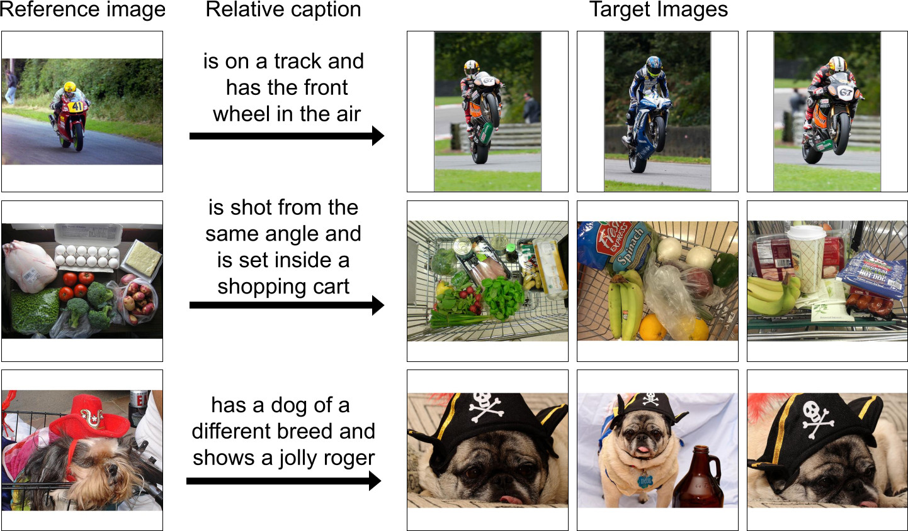

# CIRCO Dataset

[](https://arxiv.org/abs/2303.15247)
[](https://github.com/miccunifi/CIRCO)

This is the **official repository** of the **C**omposed **I**mage **R**etrieval on **C**ommon **O**bjects in context (CIRCO) dataset.

For more details please see our [**paper**](https://arxiv.org/abs/2303.15247) "*Zero-shot Composed Image Retrieval With Textual Inversion*".

>You are currently viewing the dataset repository. If you are looking for more information about our method SEARLE see the [repository](https://github.com/miccunifi/SEARLE).

## Table of Contents

* [Overview](#overview)
* [Download](#download)
  * [Annotations](#annotations)
  * [Images](#images)
  * [Data Structures](#data-structure)
* [Test Evaluation Server](#test-evaluation-server)
  * [Submission Format](#submission-format)
* [Utility Scripts](#utility-scripts)
* [Authors](#authors)
* [Citation](#citation)

## Overview
**CIRCO** (**C**omposed **I**mage **R**etrieval on **C**ommon **O**bjects in context) is an open-domain benchmarking
dataset for Composed Image Retrieval (CIR) based on real-world images from [COCO 2017 unlabeled set](https://cocodataset.org/#home).
It is the first CIR dataset with multiple ground truths and aims to address the problem of false negatives in existing
datasets. CIRCO comprises a total of 1020 queries, randomly divided into 220 and 800 for the validation and test set,
respectively, with an average of 4.53 ground truths per query. We evaluate the performance on CIRCO using mAP@K.



## Download
CIRCO is structured similarly to [CIRR](https://github.com/Cuberick-Orion/CIRR) and [FashionIQ](https://github.com/XiaoxiaoGuo/fashion-iq),
two popular datasets for CIR.

Start by cloning the repository:
```bash
git clone https://github.com/miccunifi/CIRCO.git
```

### Annotations
The annotations are provided in the `annotations` folder. For each split, a JSON file contains the list of the
corresponding annotations. Each annotation comprise the following fields:
* `reference_img_id`: the id of the reference image;
* `target_img_id`: the id of the target image (the one we used to write the relative caption);
* `relative_caption`: the relative caption of the target image;
* `shared_concept`: the shared concept between the reference and target images (useful to clarify ambiguities);
* `gt_img_ids`: the list of ground truth images;
* `id`: the id of the query.


<details>
<summary>Click to see an annotation example</summary>

```json
 {
    "reference_img_id": 85932,
    "target_img_id": 9761,
    "relative_caption": "is held by a little girl on a chair",
    "shared_concept": "a teddy bear",
    "gt_img_ids": [
        9761,
        489535,
        57541,
        375057,
        119881
    ],
    "id": 0
}
```
</details>

Note that:
* `target_img_id` and `gt_img_ids` are not available for the test set.
* `target_img_id` always corresponds to the first element of `gt_img_ids`.

### Images
CIRCO is based on images taken from the [COCO 2017 unlabeled set](https://cocodataset.org/#home).
Please see the [COCO website](https://cocodataset.org/#download) to download both the images and the corresponding annotations.

**Tip**: sometimes when clicking on the download link from the COCO website, the download does not start. In this case,
copy the download link and paste it in a new browser tab.

Create a folder named `COCO2017_unlabeled` in the `CIRCO` folder:
```bash
cd CIRCO
mkdir COCO2017_unlabeled
```
After downloading the images and the annotations, unzip and move them to the `COCO2017_unlabeled` folder.

### Data Structure
After the download, the data structure should be as follows:
```
CIRCO
└─── annotations
        | test.json
        | train.json

└─── COCO2017_unlabeled
    └─── annotations
        | image_info_unlabeled2017.json
        
    └─── unlabeled2017
        | 000000243611.jpg
        | 000000535009.jpg
        | 000000097553.jpg
        | ...
```

## Test Evaluation Server
We do not release the ground truth labels for CIRCO test split. Instead, we host an [evaluation server](https://circo.micc.unifi.it/)
to allow researchers to evaluate their models on the test split. The server is hosted independently, so please email us
if the site is unreachable.

Once you have submitted your predictions, you will receive an email with the results.

### Submission Format
The evaluation server accepts a JSON file where the keys are the query ids and the values are the lists of the top 50
retrieved images.

**Note that:**
* the submission file must contain all the queries in the test set;
* to limit the size of the submission file, you must submit only the top 50 retrieved images for each query.


The submission file should be formatted as the following example:
<details>
<summary>Click to expand</summary>

```json
{
    "0": [
        9761,
        489535,
        57541,
        375057,
        119881,
        ...
    ],
    "1": [
        9761,
        489535,
        57541,
        375057,
        119881,
        ...
    ],
    ...
    "799": [
        9761,
        489535,
        57541,
        375057,
        119881,
        ...
    ],
}
```

</details>

Under the ```submission_examples/``` directory, we provide two examples of submission files: one for the validation set and one for the test set.
Since we release the GT labels for the validation set, you do not need to submit a submission file to evaluate your model on the validation set.
We provide the submission file for the validation set only to test the evaluation server code through the ```evaluation.py``` script.


## Utility Scripts
Under the ```src/``` directory, we provide some utility scripts to help you in the usage of the dataset:
* ```dataset.py```: contains the ```CIRCODataset``` class, which is a PyTorch Dataset class that can be used to load the dataset;
* ```evaluation.py```: contains the code which is running on the server to evaluate the submitted predictions.

## Authors
* [**Alberto Baldrati**](https://scholar.google.com/citations?hl=en&user=I1jaZecAAAAJ)**\***
* [**Lorenzo Agnolucci**](https://scholar.google.com/citations?user=hsCt4ZAAAAAJ&hl=en)**\***
* [**Marco Bertini**](https://scholar.google.com/citations?user=SBm9ZpYAAAAJ&hl=en)
* [**Alberto Del Bimbo**](https://scholar.google.com/citations?user=bf2ZrFcAAAAJ&hl=en)

**\*** Equal contribution. Author ordering was determined by coin flip.

## Citation
```bibtex
@misc{baldrati2023zeroshot,
      title={Zero-Shot Composed Image Retrieval with Textual Inversion}, 
      author={Alberto Baldrati and Lorenzo Agnolucci and Marco Bertini and Alberto Del Bimbo},
      year={2023},
      eprint={2303.15247},
      archivePrefix={arXiv},
      primaryClass={cs.CV}
}
```


## Acknowledgements
This work was partially supported by the European Commission under European Horizon 2020 Programme, grant number 101004545 - ReInHerit.
